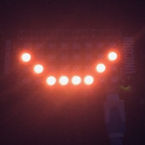

# SmilePi
Draw a smile on a Pimoroni Unicorn pHat.

## Description
The COVID-19 pandemic and the associated guidance regarding the wearing of masks presents communication challenges.  This Python code draws a rudimentary smile on a Unicorn pHAT (colourful LED matrix) from Pimoroni.  This has the potential to be placed with a facemask to add a bit of cheer :)

## Dependencies
To run the script, the following packages are required:
* `unicornhat` - Pimoroni library to control the Unicorn pHAT

## Links
* [Pimoroni Unicorn pHAT GitHub repo](https://github.com/pimoroni/unicorn-hat)
* [Buy a Pimoroni Unicorn pHAT](https://shop.pimoroni.com/products/unicorn-phat)
